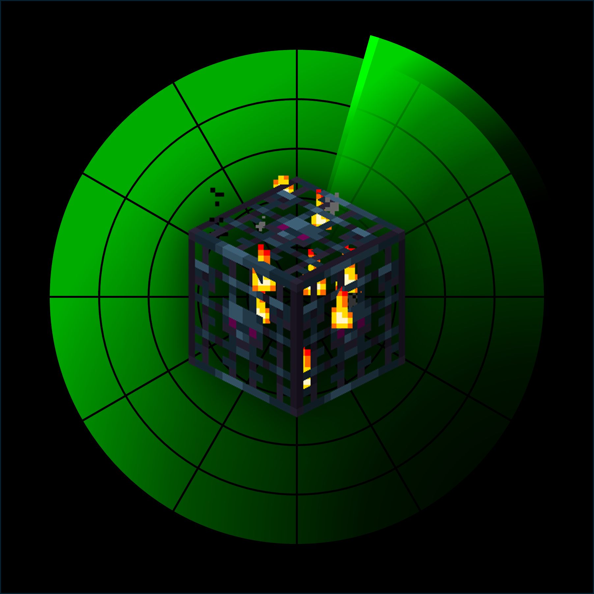

# Radar


Radar is a minecraft fabric mod, that helps you locate spawners and group them into clusters. The mod visualizes the areas in which all spawners in a given cluster are active, which is extremely useful for designing efficient mob farms.

## Features
- Locates spawners in a given chunk perimeter.
- Groups spawners that are close to each other into clusters.
- Find the area which activates all spawners in a given cluster. (Useful for designing/building mob farms)

## Usage
```
/locate_spawners [chunk radius]
```
- Search the chunks around the player in a given radius.
- Locates and highlights the position of all mob spawners.

```
/generate_clusters
```
- Groups located spawners into clusters based on their overlapping activation areas.
- Offers options to highlight individual clusters and their shared active region.

```
/reset_spawners
```
- Clears all stored spawners, clusters and regions.
- Resets everything to their original state.

## Demos


## License
This project is licensed under the [MIT LICENSE](License). You are free to use, modify, distribute the mod as long as the original license and copyright notice are included.
